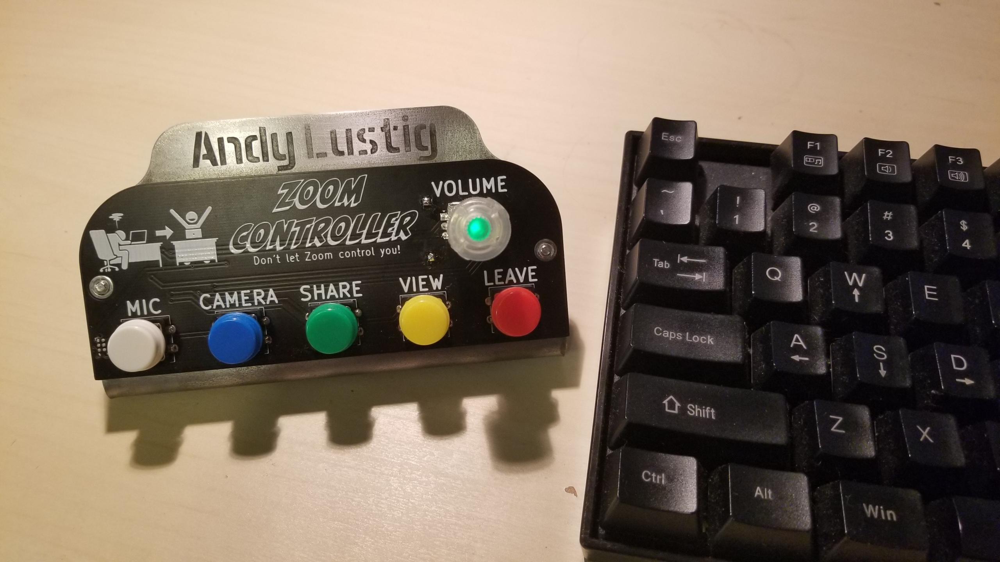
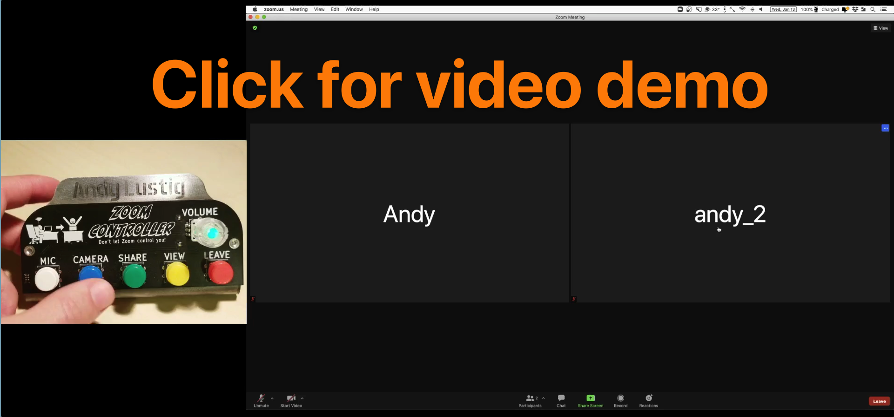
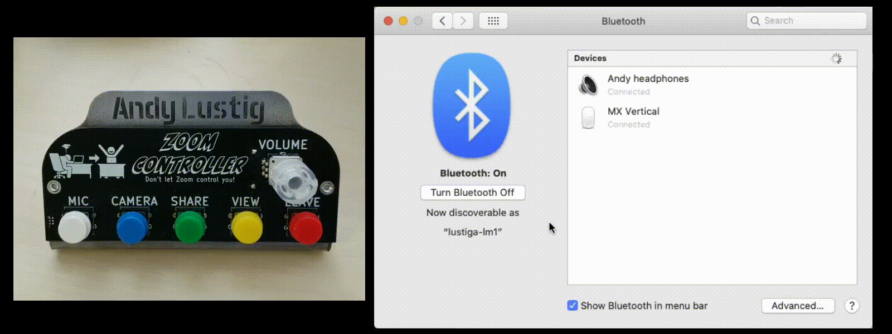
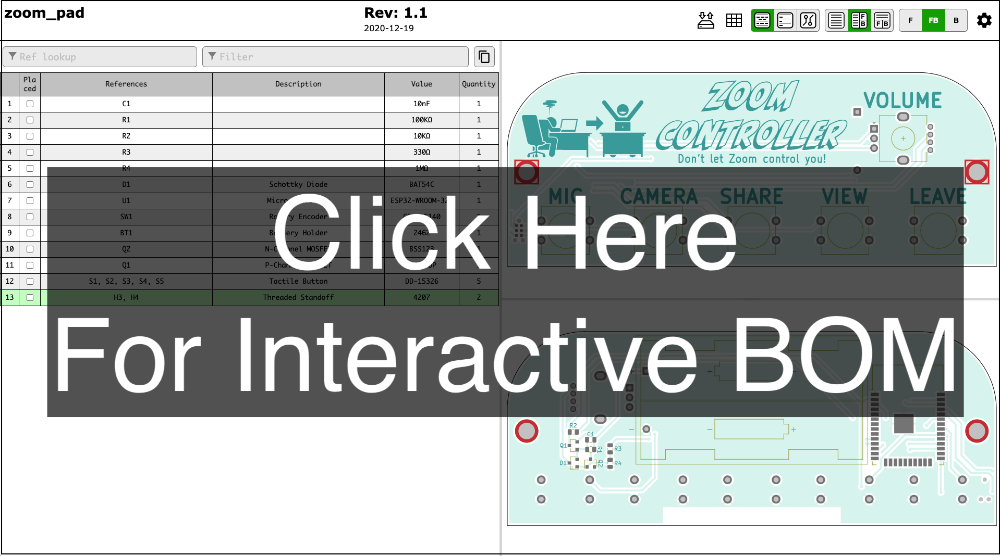

# Table of Contents

- [What is this?](#what-is-this)
  - [Demo Video](#demo-video)
- [How do I use it?](#how-do-i-use-it)
  - [Turning on](#turning-on)
  - [Connecting to Bluetooth](#connecting-to-bluetooth)
  - [Turning off](#turning-off)
  - [Disconnecting Bluetooth](#disconnecting-bluetooth)
  - [Adjust volume](#adjust-volume)
  - [Controlling Zoom!](#controlling-zoom)
  - [Switching modes](#switching-modes)
- [Getting fancy](#getting-fancy)
  - [Desktop notifications](#desktop-notifications)
  - [YouTube controller](#youtube-controller)
- [How do I make one?](#how-do-i-make-one)
  - [Stand](#stand)
  - [Electronics](#electronics)
  - [Additional hardware](#additional-hardware)
  - [Software](#software)
- [Feedback](#feedback)
# What is this?
I, like many others, found myself using Zoom video conference software a lot this past year. 
I created this device to make interacting with Zoom faster and more pleasant. 

- The Zoom Controller connects with your computer over Bluetooth and emulates keyboard key presses
- Works with Mac and Windows
- Five buttons are setup to emulate the default keyboard shortcuts in Zoom
- A knob controls the computer's media volume
- Powered by two AA batteries
- The circuit board mounts to a bent piece of 12 Gauge steel
- Bonus features include desktop notifications and YouTube Mode (see [getting fancy](#getting-fancy))

## Demo video
<div style="">
  <a href="https://alustig3.github.io/zoom-controller/demovideo.mp4">
  
  </a>
</div>

# How do I use it? 
- [Turning on](#turning-on)
- [Connecting to Bluetooth](#connecting-to-bluetooth)
- [Turning off](#turning-off)
- [Disconnecting Bluetooth](#disconnecting-bluetooth)
- [Controlling Zoom!](#controlling-zoom)
- [Switching modes](#switching-modes)

## Turning on
Press and hold the **VOLUME** knob to turn on. 
You can let go of the knob as soon as you see it light up red. 
The knob will "breathe" red light while it is trying to connect to Bluetooth. Once connected, the knob will turn green. 

The controller will automatically turn off after 20 seconds attempting and failing to connect.

## Connecting to Bluetooth
If it is the first time using Zoom Controller, you will need to add it your computer's list of Bluetooth devices. Once added, the Zoom Controller will automatically connect when turned on and within range of your computer.
### Mac
- Open System Preferences -> Bluetooth
- [Turn on](#turning-on) Zoom Controller
- When it appears in your list of Bluetooth devices, click connect. Once connected, the light will turn green, and you're good to go!
- There may be a "Keyboard Setup Assistant" window that pops up asking you to press a key to identify your keyboard. You can ignore this and just close the window.



### Windows
- Search for "bluetooth" in the search bar and select "Bluetooth and other devices settings"
- At the top, click "Add Bluetooth or other device"
- Click "Bluetooth - Mice, keyboards, pens or other kinds of Bluetooth devices"
- Turn on the Zoom Controller by pressing the **VOLUME** knob until a red light appears
- Zoom controller should appear in the "Add a device" list


## Turning off
Press and hold the **LEAVE** button. The volume knob's light will turn off when the controller is powered off.

There is an idle clock always counting. 
Every time you press a button or rotate the knob, the idle clock is reset to 0. 
If the idle clock reaches 60 minutes, the controller will automatically turn itself off to save battery.

## Disconnecting Bluetooth
The Zoom Controller can only be connected to one device at a time. If you want to use it with a different computer it is important that you first remove it from its current computer's Bluetooth device list.
### Mac
- Open to System Prefrences -> Bluetooth
- Right click on the Zoom Controller and select "Remove"
### Windows
- Search for "bluetooth" in the search bar and select "Bluetooth and other devices settings"
- Under the "Mouse, keyboard, & pen" click "Zoom Controller" and then click "Remove device"


## Controlling Zoom!

### Adjust volume
Rotate the **VOLUME** knob clockwise to increase volume, counterclockwise to decrease volume.

### Send Shortcuts on Mac
The five buttons are setup to execute the following Zoom functions by emulating their default keyboard shortcuts.

| Button | Zoom Function             | Emulated Mac Keypress                           |
|--------|---------------------------|-------------------------------------------------|
| Mic    | mute/unmute microphone    | shift + command + a                             |
| Camera | start/stop video          | shift + command + v                             |
| Share  | start/stop screen sharing | shift + command + s                             |
| View   | speaker/gallery view      | shift + command + w                             |
| Leave* | leave meeting             | command + w, followed by Return to confirm leave |

### Send Shortcuts on Windows

| Button              | Zoom Function             | Emulated Windows Keypress                  |
|---------------------|---------------------------|--------------------------------------------|
| Mic                 | mute/unmute microphone    | alt + a                                    |
| Camera              | start/stop video          | alt + v                                    |
| Share               | start/stop screen sharing | alt + s                                    |
| View (single press) | speaker view              | alt + F1                                   |
| View (double press) | gallery view              | alt + F2                                   |
| Leave*              | leave meeting             | alt + q, folowed by Enter to confirm leave |

**Zoom Controller will automatically turn off 8 seconds after pressing **LEAVE**, unless you keep it awake by pressing a button or rotating the knob within those 8 seconds. 
The knob will blink green indicating that the controller is about to turn itself off.*

## Switching modes
Keyboard shortcuts sent by Zoom Controller depend on which operating system and which application is being used. 
Because of this, there are 4 different modes that Zoom controller can be in. 
There are 2 operating system modes (Mac, Windows) and 2 application modes (Zoom, YouTube*).

**see [YouTube Controller](#youtube-controller)*

### Mac mode
- Press down the **VOLUME** button. 
- While holding the **VOLUME** button, press and hold the **MIC** button for 2 seconds
- The **VOLUME** button will blink **3** times indicating it is now in Mac mode. You can release both buttons.

### Windows mode
- Press down the **VOLUME** button. 
- While holding the **VOLUME** button, press and hold the **CAMERA** button for 2 seconds
- The **VOLUME** button will blink **7** times indicating it is now in Windows mode. You can release both buttons.

### Switch into Zoom mode
- Press and hold the VOLUME knob
- Press and release the MIC button

### Switch into YouTube mode
- Press and hold the VOLUME knob
- Press and release the CAMERA button

# Getting fancy
## Desktop notifications
You can enable Zoom Controller notifications show up on your desktop. The following notifications will appear when relevant:
- "Mac Mode"
- "Windows Mode"
- "Zoom Mode"
- "YouTube Mode"
- "Controller has been idle for awhile and will soon turn itself off. Press any button or rotate knob to keep awake"
### Mac notifications setup
- Download [Hammerspoon](https://www.hammerspoon.org/).
- Click the Hammerspooon menu bar icon and select "Open Config".
- Add the following to your `init.lua` file:
```lua
hs.hotkey.bind({"cmd", "alt", "ctrl"}, "F1", function()
  hs.alert.show("Mac Mode")
end)

hs.hotkey.bind({"cmd", "alt", "ctrl"}, "F2", function()
  hs.alert.show("Windows Mode")
end)

hs.hotkey.bind({"cmd","alt","ctrl"}, "F3", function()
  hs.notify.new({title="Zoom Controller Idle", informativeText="Controller will turn off soon\nPress any key to keep awake"}):send()
end))

hs.hotkey.bind({"cmd", "alt", "ctrl"}, "F4", function()
  hs.alert.show("Zoom Mode")
end)

hs.hotkey.bind({"cmd", "alt", "ctrl"}, "F5", function()
  hs.alert.show("YouTube Mode")
end)

```
- Save your changes to the `inti.lua` file then click the Hammerspoon menu bar icon and select "Reload Config" 
### Windows notifications setup
- Download [AutoHotkey](https://www.autohotkey.com/)
- Download this [zoom_controller_notifications.ahk](docs/zoom_controller_notifications.ahk) script file
- Once the script file is downloaded, double click it to begin running the script
- If you want the script to automatically run every time you turn on your computer, follow instructions [here](https://www.autohotkey.com/docs/FAQ.htm#Startup)

## YouTube controller
I've found this device to be super useful for watching online videos.

### Installation
- Add an extension called **Video Speed Controller** to your web browser
  - [Chrome extension](https://chrome.google.com/webstore/detail/video-speed-controller/nffaoalbilbmmfgbnbgppjihopabppdk)
  - [Firefrox extension](https://addons.mozilla.org/en-US/firefox/addon/videospeed/?utm_source=addons.mozilla.org&utm_medium=referral&utm_content=search)

### Controlling YouTube
#### Send Shortcuts
| Button | YouTube Function  | Emulated Keypress |
|--------|-------------------|-------------------|
| Mic    |                   |                   |
| Camera | rewind 10s        | z                 |
| Share  | fast forward 10s  | x                 |
| View   | toggle fullscreen | f                 |
| Leave  | leave meeting     | spacebar          |

#### Adjust playback speed
- Increase/decrease the video playback speed by rotating the VOLUME knob clockwise/counterclockwise
- Toggle between 1X speed and your adjusted playback speed by clicking the VOLUME knob
#### Adjust Volume
- Increase/decrease the volume by pressing and holding down MIC then rotating the VOLUME knob clockwise/counterclockwise.

# How do I make one?
## Stand
- File for lasercutting: [stand.dxf](https://alustig3.github.io/zoom-controller/stand.dxf)
- 0.1" thick (12Ga) steel cut and bent at https://www.oshcut.com/

## Electronics
### Bill of Materials
| Qty | Reference          | Description       | Value/MPN                                                                                                    | 
|-----|--------------------|-------------------|--------------------------------------------------------------------------------------------------------------|
| 1   | BT1                | Battery Holder    | [2462](https://www.digikey.com/product-detail/en/keystone-electronics/2466/36-2466-ND/303815)                | 
| 1   | C1                 | 0805 Capacitor    | 10nF                                                                                                         | 
| 1   | D1                 | Schottky Diode    | [BAT54C](http://www.diodes.com/_files/datasheets/ds11005.pdf)                                                | 
| 2   | H3, H4             | Threaded Standoff | [4207](https://www.adafruit.com/product/4207)                                                                | 
| 1   | Q1                 | P-Channel MOSFET  | [FDN340P](https://www.digikey.com/products/en?keywords=FDN340PCT-ND)                                         | 
| 1   | Q2                 | N-Channel MOSFET  | [BSS123](https://www.digikey.com/products/en?keywords=BSS123LT1GOSCT-ND)                                     | 
| 1   | R1                 | 0805 Resistor     | 100KΩ                                                                                                        | 
| 1   | R2                 | 0805 Resistor     | 10KΩ                                                                                                         | 
| 1   | R3                 | 0805 Resistor     | 330Ω                                                                                                         | 
| 1   | R4                 | 0805 Resistor     | 1MΩ                                                                                                          | 
| 5   | S1, S2, S3, S4, S5 | Tactile Button    | [DD-15326](https://www.sparkfun.com/products/15326)                                                          | 
| 1   | SW1                | Rotary Encoder    | [COM-15140](https://www.sparkfun.com/products/15140)                                                         | 
| 1   | U1                 | Microcontroller   | [ESP32-WROOM-32E](https://www.digikey.com/en/products/detail/espressif-systems/ESP32-WROOM-32E-4MB/11613125) | 


<div style="">
  <a href="https://alustig3.github.io/zoom-controller/ibom.html">
  
  </a>
</div>

## Additional hardware
- 6mm long M3 x 0.5mm screws: https://www.mcmaster.com/92095A179/
- Clear plastic knob for rotary encoder: https://www.sparkfun.com/products/10597

## Software
The code was developed using [PlatformIO](https://docs.platformio.org/en/latest/boards/espressif32/esp32dev.html).
An [ESP-PROG](https://www.digikey.com/en/products/detail/espressif-systems/ESP-PROG/10259352?s=N4IgTCBcDaIKYGcAOBaJAnA9gcxAXQF8g) was used to program the ESP32 microcontroller.
You should be able to use the platform.ini file from this repository, you'll just need to change the upload port. 
The platform.ini will automatically download the requisite [ESP32-BLE-Keyboard](https://github.com/T-vK/ESP32-BLE-Keyboard) library and ESP32 and Arduino frameworks.
# Feedback
If people are interested, I may consider buying some parts in bulk and selling the controllers on [Tindie](https://www.tindie.com/) or [Etsy](https://www.etsy.com/) ¯\\\_(ツ)_/¯

If you have questions, comments, or are interested in buying a Zoom Controller:

<div style="height:100px;">
  <a href="https://forms.gle/rxcJuvHoePF4XZsw5">
  
  </a>
</div>