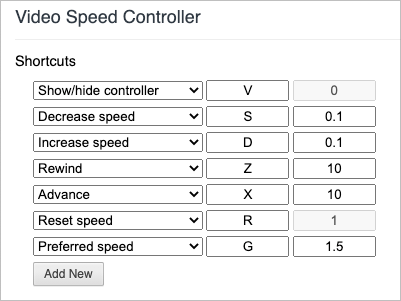

# Table of Contents

- [What is this?](#what-is-this)
- [How do I use it?](#how-do-i-use-it)
  - [Connecting to Bluetooth](#connecting-to-bluetooth)
  - [Disconnecting Bluetooth](#disconnecting-bluetooth)
  - [Turn on](#turn-on)
  - [Turn off](#turn-off)
  - [Adjust volume](#adjust-volume)
  - [Controlling Zoom!](#controlling-zoom)
  - [Switching Modes](#switching-modes)
- [Getting fancy](#getting-fancy)
  - [Desktop notifications](#desktop-notifications)
  - [YouTube controller](#youtube-controller)
- [How do I get one?](#how-do-i-get-one)
  - [Building](#building)
  - [Buying](#Buying-¯\\\_(ツ)_/¯)
- [Feedback](#feedback)
# What is this?
I, like many others, found myself using Zoom video conference software a lot this past year. 
I created this device to make interacting with the Zoom faster and more pleasant. 

- The Zoom Controller connects with your computer over Bluetooth and emulates keyboard key presses
- Five buttons are setup to emulate the default keyboard shortcuts in Zoom
- The knob controls the computer's media volume
- Powered by two AA batteries
- The circuit board mounts to bent piece of 12 Gauge steel
- Bonus feature include desktop notifications and YouTube Mode (see [getting fancy](#getting-fancy))


# How do I use it? 
- [Connecting to Bluetooth](#connecting-to-bluetooth)
- [Disconnecting Bluetooth](#disconnecting-bluetooth)
- [Turn on](#turn-on)
- [Turn off](#turn-off)
- [Controlling Zoom!](#controlling-zoom)
- [Change operating system](#change-operating-system)

## Connecting to Bluetooth
If it is the first time using Zoom Controller, you will need to add it your computer's list of Bluetooth devices. Once added, the Zoom Controller will automatically connect when turned on and within range of your computer.
### Mac
- Open to System Prefrences -> Bluetooth
- Turn on the Zoom Controller by pressing the **VOLUME** knob until a red light appears
- When it appears in your list of Bluetooth devices, click connect. Once connected, the light will turn green.
<!--  -->
### Windows
- Search for "bluetooth" in the search bar and select "Bluetooth and other devices settings"
- At the top, click "Add Bluetooth or other device"
- Click "Bluetooth"
- Turn on the Zoom Controller by pressing the **VOLUME** knob until a red light appears
- Zoom controller should appear in the "Add a device" list

## Disconnecting Bluetooth
The Zoom Controller can only be connected to one device at a time. If you want to use it with a different computer it is important that you first remove it from it's current computer's bluetooth device list.
### Mac
- Open to System Prefrences -> Bluetooth
- Right click on the Zoom Controller and select "Remove"
### Windows
- Search for "bluetooth" in the search bar and select "Bluetooth and other devices settings"
- Under the "Mouse, keyboard, & pen" 
## Turn on
Press and hold the **VOLUME**  knob to turn on. 
You can let go of the knob as soon as you see it light up. 
The knob will "breathe" red light while it is trying to connect. 
Once connected, the knob will turn green. 

The controller will automatically turn off after 20 seconds attempting and failing to connect.

## Turn off
Press and hold the **LEAVE** button. The volume knob's light will turn off when the controller is powered off.

There is an idle clock always counting. 
Every time you press a button or rotate the knob, the idle clock is reset to 0. 
If the idle clock reaches 60 minutes, the controller will automatically turn itself off to save battery.

## Controlling Zoom!

### Adjust volume
Rotate the **VOLUME** knob clockwise to increase volume, counterclockwise to decrease volume.

### Send Shortcuts on Mac
The five buttons are setup to execute the following Zoom functions by emulating their default keyboard shortcuts.

| Button | Zoom Function             | Emulated Mac Keypress |
|--------|---------------------------|-----------------------|
| Mic    | mute/unmute microphone    | shift + command + a   |
| Camera | start/stop video          | shift + command + v   |
| Share  | start/stop screen sharing | shift + command + s   |
| View   | speaker/gallery view      | shift + command + w   |
| Leave* | leave meeting             | command + w           |

### Send Shortcuts on Windows

| Button              | Zoom Function             | Emulate Windows Keypress |
|---------------------|---------------------------|--------------------------|
| Mic                 | mute/unmute microphone    | alt + a                  |
| Camera              | start/stop video          | alt + v                  |
| Share               | start/stop screen sharing | alt + s                  |
| View (single press) | speaker view              | alt + F1                 |
| View (double press) | gallery view              | alt + F2                 |
| Leave*              | leave meeting             | alt + q                  |
\*Zoom Controller will automatically turn off 8 seconds after pressing **LEAVE**, unless you keep it awake by pressing a button or rotating the knob within those 8 seconds. The knob will blink green indicating that it is about to turn itself off.

## Switching Modes
Keyboard shortcuts sent by Zoom Controller depend on which operating system and which application is being used. 
Because of this, there are 4 different modes that Zoom controller can be in. 
There are 2 operating system modes (Mac, Windows) and 2 application modes (Zoom, YouTube*)

*see [YouTube Controller](##youtube-controller)

### Mac Mode
- Press down the **VOLUME** button. 
- While holding the **VOLUME** button, press and hold the **MIC** button for 2 seconds
- The **VOLUME** button will blink **3** times indicating it is now in Mac mode. You can release both buttons.

### Windows Mode
- Press down the **VOLUME** button. 
- While holding the **VOLUME** button, press and hold the **CAMERA** button for 2 seconds
- The **VOLUME** button will blink **7** times indicating it is now in Windows mode. You can release both buttons.

### Switch into Zoom mode
- Press and hold the VOLUME knob
- Press and release the MIC button

### Switch into YouTube mode
- Press and hold the VOLUME knob
- Press and release the CAMERA button

# Getting fancy
## Desktop notifications
You can enable Zoom Controller notifications show up on your desktop. The following notifications will appear when relevant:
- "Mac Mode"
- "Windows Mode"
- "Zoom Mode"
- "YouTube Mode"
- "Controller has been idle for awhile and will soon turn itself off. Press any button or rotate knob to keep awake"
### Mac Notifications Setup
- Download [Hammerspoon](https://www.hammerspoon.org/).
- Click the Hammerspooon menu bar icon and select "Open Config".
- Add the following to your `init.lua` file:
```lua
hs.hotkey.bind({"cmd", "alt", "ctrl"}, "F1", function()
  hs.alert.show("Mac Mode")
end)

hs.hotkey.bind({"cmd", "alt", "ctrl"}, "F2", function()
  hs.alert.show("Windows Mode")
end)

hs.hotkey.bind({"cmd","alt","ctrl"}, "F3", function()
  hs.notify.new({title="Zoom Controller", informativeText="Controller has been idle for 5 minutes\n Press any key to keep awake"}):send()
end)

hs.hotkey.bind({"cmd", "alt", "ctrl"}, "F4", function()
  hs.alert.show("Zoom Mode")
end)

hs.hotkey.bind({"cmd", "alt", "ctrl"}, "F5", function()
  hs.alert.show("YouTube Mode")
end)

hs.hotkey.bind({"cmd", "alt", "ctrl"}, "F6", function()
  hs.alert.show("Blackboard Mode")
end)
```
- Save your changes to the `inti.lua` file then click the Hammerspoon menu bar icon and select "Reload Config" 
### Windows notifications setup
- Download [AutoHotkey](https://www.autohotkey.com/)
- Download this [zoom_controller_notifications.ahk](zoom_controller_notifications.ahk) script file
- Once the script file is downloaded, double click it to begin running the script
- If you want the script to automatically run every time to turn on your computer, follow instructions [here](https://www.autohotkey.com/docs/FAQ.htm#Startup)

## YouTube controller
I've found this device to be super useful for watching online videos. I installed the [Video Speed Controller](https://chrome.google.com/webstore/detail/video-speed-controller/nffaoalbilbmmfgbnbgppjihopabppdk) extension. 

My extension settings are the following




### Controlling YouTube
#### Send Shortcuts
| Button | YouTube Function  | Emulated Keypress |
|--------|-------------------|-------------------|
| Mic    |                   |                   |
| Camera | rewind 10s        | z                 |
| Share  | fast forward 10s  | x                 |
| View   | toggle fullscreen | f                 |
| Leave  | leave meeting     | spacebar          |

#### Adjust playback speed
Increase/decrease the video playback speed by rotating the VOLUME knob clockwise/counterclockwise.
#### Adjust Volume
Increase/decrease the volume by pressing and holding down MIC then rotating the VOLUME knob clockwise/counterclockwise.


# How do I get one?
## Building
### Bill of Materials
| Qty | Reference          | Description       | Value/MPN                                                                                                    | 
|-----|--------------------|-------------------|--------------------------------------------------------------------------------------------------------------|
| 1   | BT1                | Battery Holder    | [2462](https://www.digikey.com/product-detail/en/keystone-electronics/2466/36-2466-ND/303815)                | 
| 1   | C1                 | 0805 Capacitor    | 10nF                                                                                                         | 
| 1   | D1                 | Schottky Diode    | [BAT54C](http://www.diodes.com/_files/datasheets/ds11005.pdf)                                                | 
| 2   | H3, H4             | Threaded Standoff | [4207](https://www.adafruit.com/product/4207)                                                                | 
| 1   | Q1                 | P-Channel MOSFET  | [FDN340P](https://www.digikey.com/products/en?keywords=FDN340PCT-ND)                                         | 
| 1   | Q2                 | N-Channel MOSFET  | [BSS123](https://www.digikey.com/products/en?keywords=BSS123LT1GOSCT-ND)                                     | 
| 1   | R1                 | 0805 Resistor     | 100KΩ                                                                                                        | 
| 1   | R2                 | 0805 Resistor     | 10KΩ                                                                                                         | 
| 1   | R3                 | 0805 Resistor     | 330Ω                                                                                                         | 
| 1   | R4                 | 0805 Resistor     | 1MΩ                                                                                                          | 
| 5   | S1, S2, S3, S4, S5 | Tactile Button    | [DD-15326](https://www.sparkfun.com/products/15326)                                                          | 
| 1   | SW1                | Rotary Encoder    | [COM-15140](https://www.sparkfun.com/products/15140)                                                         | 
| 1   | U1                 | Microcontroller   | [ESP32-WROOM-32E](https://www.digikey.com/en/products/detail/espressif-systems/ESP32-WROOM-32E-4MB/11613125) | 


<div style="">
  <a href="https://alustig3.github.io/zoom-controller/ibom.html">
  
  </a>
</div>


# Feedback
## Selling  ¯\\\_(ツ)_/¯
If people are interested, I may consider buying some parts in bulk and selling the controllers on [Tindie](https://www.tindie.com/) or [Etsy](https://www.etsy.com/).

If you have questions, comments, or are interested in buying a Zoom Controller:

<div style="height:100px;">
  <a href="https://forms.gle/rxcJuvHoePF4XZsw5">
  
  </a>
</div>